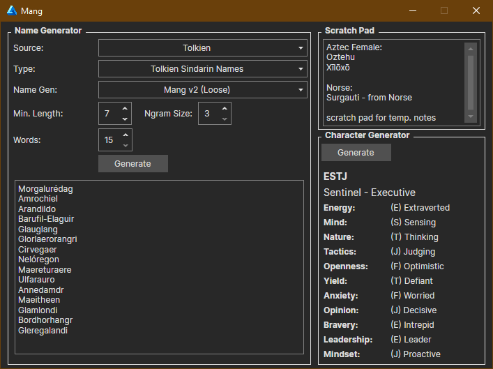

# Mang



Mang is a tool I use while writing to generate names for things and to generate info for characters.

The name generator uses Markov chains to generate realistic-sounding output based on predefined input. The input is usually sourced from real-world cultures, but can also be sourced from any Fantasy setting.

The character generator just randomly selects various traits that may describe a character, and then chooses how much "stress" that trait is under. For example, an Optimistic person with high Stress may be undergoing some life events that are challenging that aspect of themselves.

On their own the sliders mean nothing, but combined can tell a story about that character. For example, a person who has high Confidence and Dedication, whose Defiance, Leadership, and Planning are stressed, can become a revolutionary / rebel type character.

## Behind the Scenes

Mang is powered by `manglib`, a C# library. This has the collection of preset names, but if the library alone is used, any collection of strings can be supplied as input to the name generator.

## How to Use
After downloading and linking the project to your own, Mang is simple to use:
```
var markovGenerator = new MangDefaultGenerator(myWordList, ngramLength);
var wordList = new List<string>();
for (var i = 0; i < 15; i++)
{
  wordList.Add(markovGenerator.GenerateWord(minimumWordLength);
}
```

Sensible defaults are provided so you only have to worry about picking what "type" of word to generate. To change the type, just new up a generator
```
markovGenerator = new MangDefaultGenerator(Lovecraft.OldOnes, ngramLength);
```

Then generate a new word list.

### Token Length (n-grams)
The Markov chain generator works off tokens, or n-grams, consisting of *x*-character long substrings from the input. Imagine you pass in a word like this `imagine` with a token length of `3`. The Markov data will generate tokens from that string like so:
```
ima
mag
agi
gin
ine
```

So, you can imagine that the token length configured has some impact on the output's similarity to the input. In my own use, I've found a length of `3` is typically good enough for unique, but closely related, output. But you experiment freely with the token length.

The value of the `tokenLength` parameter is clamped between 1 and 5 inclusively.

## Planned Work
In the future I would like to do a few things with this:

* Add a string distance comparison to check input and output similarity, and toss output that's too similar
* Add a "grammar" builder to make sure output follows grammar rules of the input (vowel-consonant pairing, for example)
* ???

## A Note on the Presets
Categorization is a Hard Problem. I've categorized the names in these presets to the best of my ability, but if any are in the wrong category or the category is mislabeled, please correct me with a comment, email, or pull request, and I will fix things.

## Special Thanks
The majority of the included presets were gathered from resources like [Kate Monk's Onomastikon](https://tekeli.li/onomastikon/index.html),